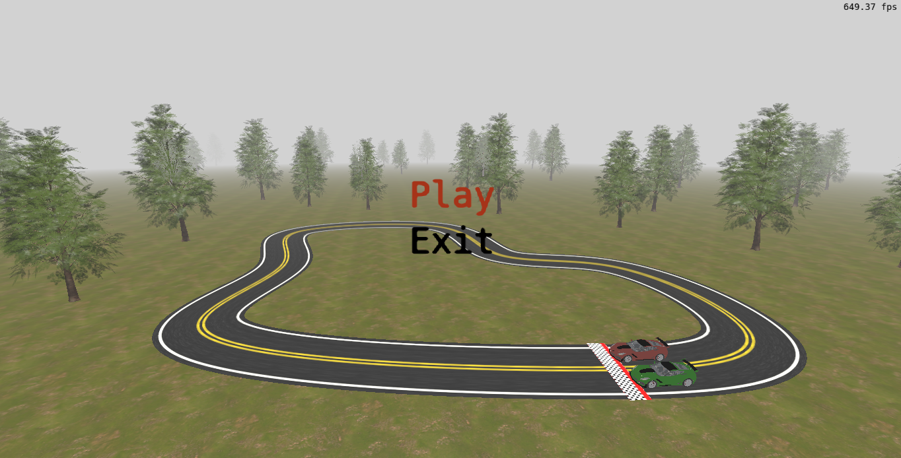
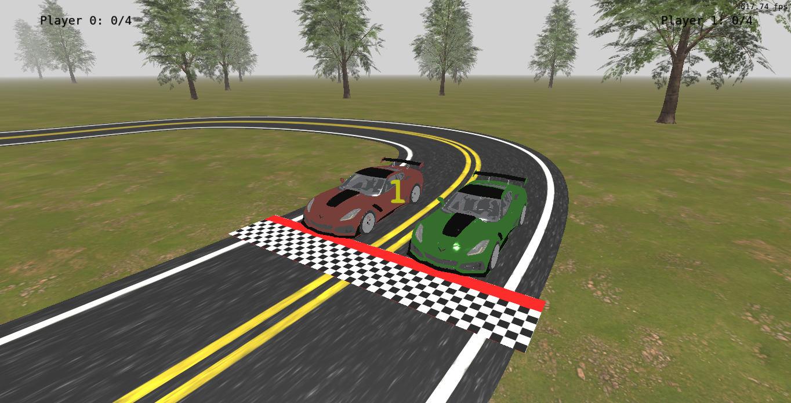
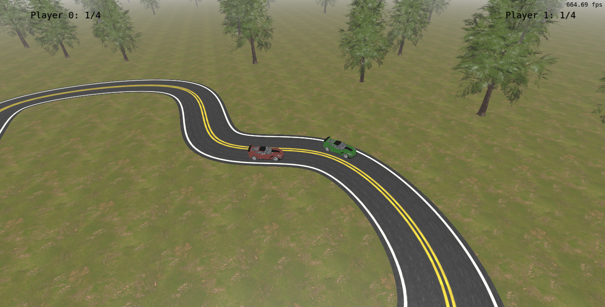

# Computação Gráfica e Visualização I (INF01047) - INF/UFRGS

O enunciado completo do trabalho final no Moodle:

https://moodle.ufrgs.br/mod/assign/view.php?id=6018620

# Relatório do Trabalho Final de CGVIS

## 1. A Aplicação Desenvolvida

A aplicação desenvolvida é um jogo de corrida no estilo autorama para dois jogadores, onde os carros seguem um caminho pré-calculado sobre uma curva do tipo b-spline cúbica por partes. Mecanicamente o jogo se inspira nas funcionalidades de uma das seções do jogo Mario Party, onde os carros competem por completar voltas no menor tempo enquanto buscam se manter abaixo do limite máximo de velocidade da pista, que varia conforme o ângulo de curvatura em cada ponto da pista. Visualmente, o jogo busca um visual com modelos de carros e outros objetos que tendem mais ao realismo, como os do jogo Gran Turismo 5.

## 2. Contribuição de cada membro

Toda a aplicação foi desenvolvida por mim, Arthur Rambo Prediger.

## 3. Sobre Uso de Inteligência Artificial no Desenvolvimento

IAs generativas foram utilizadas no desenvolvimento de funcionalidades e aspectos pontuais da aplicação. O ChatGPT na versão gratuita foi utilizada na implementação dos dois comportamentos de câmera presentes no jogo e também para implementar um teste de intersecção entre OBBs (Oriented Bounding Boxes), enquanto que o Grok na versão gratuita foi utilizado para um shader que adapta-se os parâmetros básicos de iluminação utilizados em shader Blinn-Phong para uma versão simplificada de PBR com uso de BRDF.

## 4. Imagens

## 5. Manual do Jogo

### Controles de Menu: 
- Setas para Cima e para Baixo: alternam entre as opções do menu;
- Enter seleciona a opção marcada.

### Controles de Jogo:

#### Jogador 0:
- Tecla W: acelera o carro;
- Tecla S: desacelera o carro;
- Tecla A: faz com que o carro mude para uma faixa mais externa da pista;
- Tecla D: faz com que o carro mude para uma faixa mais interna da pista;

#### Jogador 1: 
- Tecla Cima: acelera o carro;
- Tecla Baixo: desacelera o carro;
- Tecla Esquerda: faz com que o carro mude para uma faixa mais externa da pista;
- Tecla Direita: faz com que o carro mude para uma faixa mais interna da pista;

## 6. Explicação de Passos para Compilação

### Requerimento para todos os SOs

Um compilador com suporte a versão 20 do C++.

### Windows com MSVC
A versão padrão de desenvolvimento do jogo foi feita em Windows utilizando o MSVC na sua versão presente na IDE Visual Studio 2022 para compilação da aplicação. Para compilar o jogo por esse método basta:

1. Executar o arquivo [vs2022build.bat](vs2022build.bat); 

2. Abrir a solução do Visual Studio 2022 gerada no caminho 'build/vs2022/SlotcarGame.sln';

3. Compilar o projeto 'main' em versão de Release que gerará o executável no caminho 'bin/Release/main.exe'.

### Linux com Makefile
Abra um terminal, navegue até a pasta onde está este código fonte, e execute o comando "make" para compilar. Para executar o código compilado, execute o comando "make run".

### Linux com VSCode

1. Instale o VSCode seguindo as instruções em https://code.visualstudio.com/ .

2. Instale as extensões "ms-vscode.cpptools" e "ms-vscode.cmake-tools" no VSCode. Se você abrir o diretório deste projeto no VSCode, automaticamente será sugerida a instalação destas extensões (pois estão listadas no arquivo ".vscode/extensions.json").

3. Clique no botão de "Play" NA BARRA INFERIOR do VSCode para compilar e executar o projeto. Na primeira compilação, a extensão do CMake para o VSCode irá perguntar qual compilador você quer utilizar. Selecione da lista o compilador que você deseja utilizar.

Veja mais instruções de uso do CMake no VSCode em:

https://github.com/microsoft/vscode-cmake-tools/blob/main/docs/README.md

## 7. Link de Vídeo do Jogo